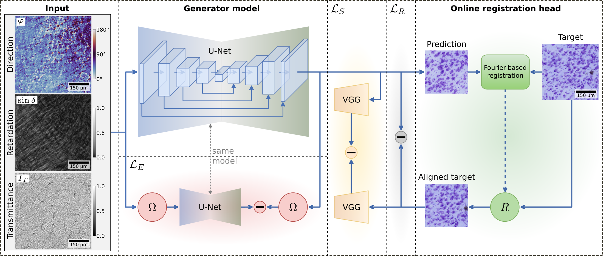

<div align="center">

<a href="https://pytorch.org/get-started/locally/"></a>
<a href="https://pytorchlightning.ai/"></a>
<a href="https://hydra.cc/"></a>
<a href="https://github.com/HelmholtzAI-Consultants-Munich/ML-Pipeline-Template"></a>
<a href="https://github.com/pyscaffold/pyscaffoldext-dsproject"></a>

</div>

# Fibers to Cells



Virtual Cresyl violet staining from 3D-PLI.


## Quickstart

Clone the repository and install it using pip:
```bash
    git clone https://jugit.fz-juelich.de/inm-1/bda/personal/aoberstrass/projects/pli2cells.git
    cd pli2cells
    pip install -e .
```

Installation requires `gxx_linux-64` and `openmpi` or `mpich` packages.


## Usage

Debugging the pipeline:
```bash
sbatch scripts/debug.sbatch
```

Full-scale training:
```bash
sbatch scripts/train.sbatch unetdftstyle_affine
```
where the `unetdftstyle_affine` experiment can be replaced with any configuration under `configs/experiment`.

To apply trained models adjust and run
```bash
sbatch scripts/apply_models.sbatch
```


## Project Organization
```
├── configs                       <- Hydra configuration files
│   ├── callbacks                     <- Callbacks configs
│   ├── datamodule                    <- Datamodule configs
│   ├── debug                         <- Debugging configs
│   ├── experiment                    <- Experiment configs
│   ├── hparams_search                <- Hyperparameter search configs
│   ├── local                         <- Local configs
│   ├── log_dir                       <- Logging directory configs
│   ├── logger                        <- Logger configs
│   ├── model                         <- Model configs
│   ├── trainer                       <- Trainer configs
│   │
│   └── train.yaml                    <- Main config for training
│
├── data                          <- Project data
│   └── vervet1818-stained            <- Repository containing train and test data
│
├── logs
│   ├── experiments                   <- Logs from experiments
│   ├── slurm                         <- Slurm outputs and errors
│   └── tensorboard/mlruns/...        <- Training monitoring logs
│
├── scripts                       <- Scripts used in project
│   ├── apply_model.py                <- Script to apply a trained model
│   ├── apply_models.sbatch           <- Job submission to apply a model
│   ├── debug.sbatch                  <- Debug training job
│   ├── train.py                      <- Run training
│   └── train.sbatch                  <- Training job
│
├── src/pli_cyto                  <- Source code
│   ├── datamodules                   <- Lightning datamodules
│   ├── eval                          <- Code for evaluation scores
│   ├── models                        <- Lightning models
│   ├── utils                         <- Utility scripts
│   │
│   ├── testing_pipeline.py           <- Model evaluation workflow
│   └── training_pipeline.py          <- Model training workflow
│
├── LICENSE.txt                   <- Apache License Version 2.0
├── pyproject.toml                <- Build configuration.
├── setup.cfg                     <- Declarative configuration of the project.
└── README.md                     <- This file
```

## DataLad

To retrieve the training data run
```bash
datalad get datasets/vervet1818-stained/
```
or
``` bash
datalad get --reckless=ephemeral datasets/vervet1818-stained
```
if you just want to link to the data on a remote without copying the files.
Additional sources of submodules are specified as `datalad.get.subdataset-source-candidate` in `.datalad/config` (See the [doc](http://handbook.datalad.org/en/latest/beyond_basics/101-148-clonepriority.html)).

Please note that access to the data can only be provided on request.

## How to Cite

If you use this work in your research, please cite it as follows:


```text
@article{oberstrass2025,
  title={From Fibers to Cells: Fourier-Based Registration Enables Virtual Cresyl Violet Staining From 3D Polarized Light Imaging},
  author={Oberstrass, Alexander and Vaca, Esteban and Upschulte, Eric and Niu, Meiqi and {Palomero-Gallagher}, Nicola and Graessel, David and Schiffer, Christian and Axer, Markus and Amunts, Katrin and Dickscheid, Timo},
  journal={arXiv preprint arXiv:2505.11394},
  year={2025}
}
```
